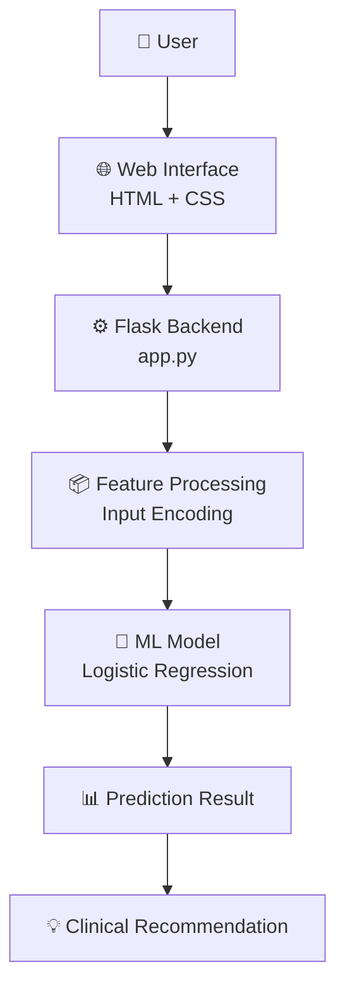
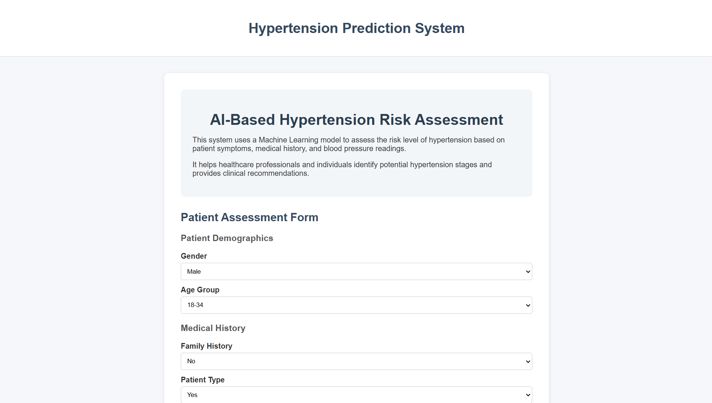
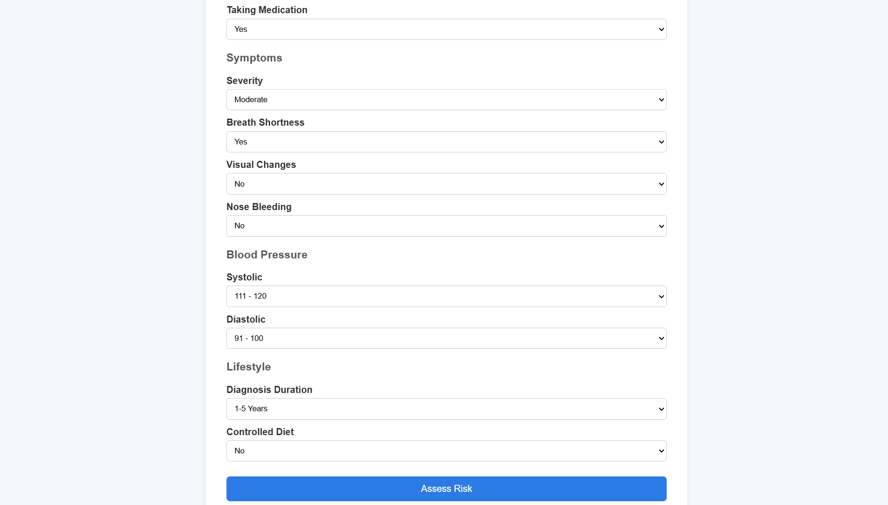
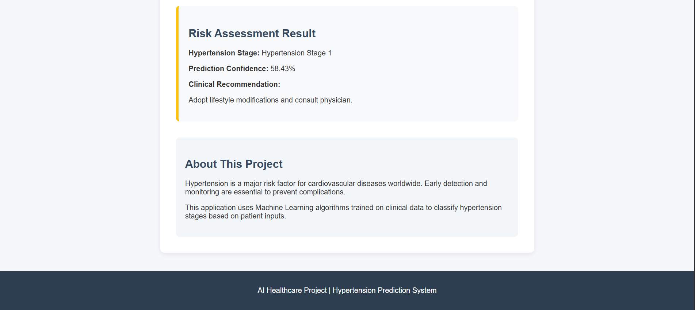

# 🫀 Hypertension Prediction System

An AI-powered web application that predicts the stage of hypertension using patient health data and machine learning.

This system analyzes medical history, symptoms, and blood pressure readings to classify hypertension risk and provide clinical recommendations.

---

# 🚀 Live Demo

🔗 **Deployed Web App:**  
https://hypertension-prediction-ml.onrender.com/

---

# 🧠 Machine Learning Model

The system uses a **Logistic Regression model** trained on hypertension-related clinical features.

### Model Capabilities
- Classifies hypertension stage
- Provides confidence score
- Generates clinical recommendations
- Supports healthcare risk assessment

### Target Classes

| Stage | Description |
|------|-------------|
| 0 | Normal |
| 1 | Hypertension Stage 1 |
| 2 | Hypertension Stage 2 |
| 3 | Hypertensive Crisis |

---

# 🖥️ Web Application

The application is built using **Flask** and provides a user-friendly medical interface for risk assessment.

### Features

✔ AI-powered hypertension stage prediction  
✔ Professional medical interface  
✔ Real-time patient data input form  
✔ Risk classification with confidence score  
✔ Clinical recommendations for each stage  
✔ Responsive design

---

# 🧾 Patient Input Features

The model evaluates the following parameters:

### Demographics
- Gender
- Age Group

### Medical History
- Family History
- Patient Type
- Medication Status

### Symptoms
- Severity
- Breath Shortness
- Visual Changes
- Nose Bleeding

### Blood Pressure
- Systolic Level
- Diastolic Level

### Lifestyle
- Diagnosis Duration
- Controlled Diet

---

## 🏗️ Project Architecture

```text
Hypertension-Prediction-ML
│
├── 📂 data
│
├── 📂 model
│   └── 🧠 hypertension_model.pkl
│
├── 📂 notebook
│   └── 📓 hypertension_model.ipynb
│
├── 📂 templates
│   └── 🌐 index.html
│
├── 📂 static
│   └── 🎨 style.css
│
├── ⚙️ app.py
├── 📦 requirements.txt
└── 📘 README.md


---
```
## 🧠 System Architecture


---

# ⚙️ Installation

**Clone the repository**

git clone - https://github.com/veerkarnn/Hypertension-Prediction-ML.git


Navigate to the project folder
```bash
cd Hypertension-Prediction-ML
```
Create virtual environment


```bash
python -m venv venv
```

Activate environment

For Windows-

```bash
venv\Scripts\activate
```

Install dependencies

```bash
pip install -r requirements.txt
```

Run the Flask application

```bash
python app.py
```

Open in browser

```bash
http://127.0.0.1:5000
```

---

# 📊 Model Performance

| Metric | Score |
|------|------|
| Accuracy | ~95% |
| Precision | High |
| Recall | High |
| F1 Score | Strong |

The Logistic Regression model was selected due to its **excellent generalization ability and lower overfitting risk** compared to other algorithms.

---

# 🧪 Algorithms Tested

The following machine learning models were evaluated:

- Logistic Regression ✅ (Selected)
- Decision Tree
- Random Forest
- Support Vector Machine
- KNN
- Ridge Classifier
- Naive Bayes

Logistic Regression provided the **best balance between accuracy and generalization**.

---

## 📸 Application Screenshots

### 🏠 Home Page



### 📋 Patient Assessment Form



### 📊 Prediction Result



---

# 🛠️ Tech Stack

### Backend
- Flask
- Python

### Machine Learning
- Scikit-learn
- NumPy
- Joblib

### Frontend
- HTML
- CSS

### Deployment
- Render

### Version Control
- Git
- GitHub

---

# 🌍 Deployment

The project is deployed using **Render**.

Steps used for deployment:

1. Push project to GitHub
2. Connect repository to Render
3. Install dependencies using requirements.txt
4. Start server using Gunicorn

---

# 🎯 Use Cases

- Early hypertension risk screening
- Healthcare research
- Clinical decision support
- Educational machine learning project

---

# 📈 Future Improvements

Possible improvements for the project:

- Add real patient datasets
- Improve UI with React
- Add charts and health analytics
- Integrate hospital APIs
- Build mobile version

---

# 👨‍💻 Author

**Veerbhadra Raj**

GitHub: `https://github.com/veerkarnn`

---

# ⭐ If you like this project

Give it a ⭐ on GitHub!
